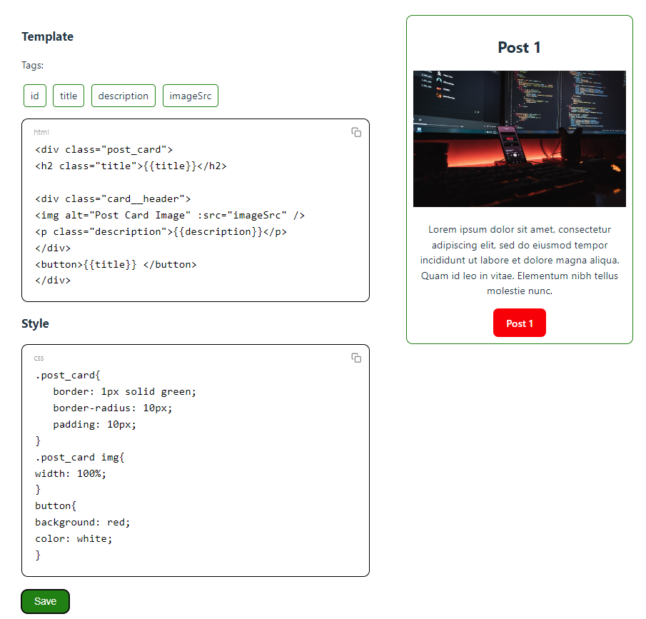
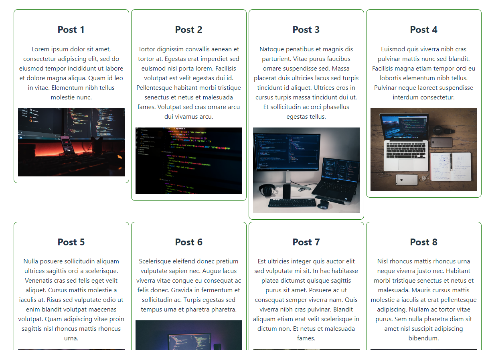

# TEST APP

- NodeJs
- ExpressJs
- VueJs

## Server

- NodeJs
- ExpressJs

### Install & Run
- `npm install`             - install npm modules
- `npm run dev`             - run server

### API
- `/api/get-all-posts`      - "GET" get all posts
- `/api/get-post/:id`       - "GET" get post by id
- `/api/vue-sfc`            - "GET" get vue SFC template and styles
- `/api/vue-sfc`            - "POST" save vue SFC template and styles ( { template: "" , style: "" } )

## Admin

- VueJs
- vue3-runtime-template

 ### Install & Run
- `npm install`             - install npm modules
- `npm run dev`             - run admin app

## Client

- VueJs
- vue3-runtime-template

 ### Install & Run
- `npm install`             - install npm modules
- `npm run dev`             - run admin app

## Docker compose

### Compose All
- `docker-compose up --build` - run in main folder for generate and run all docker containers

#### URLs
- http://localhost:8000/
- http://localhost:8000/admin/